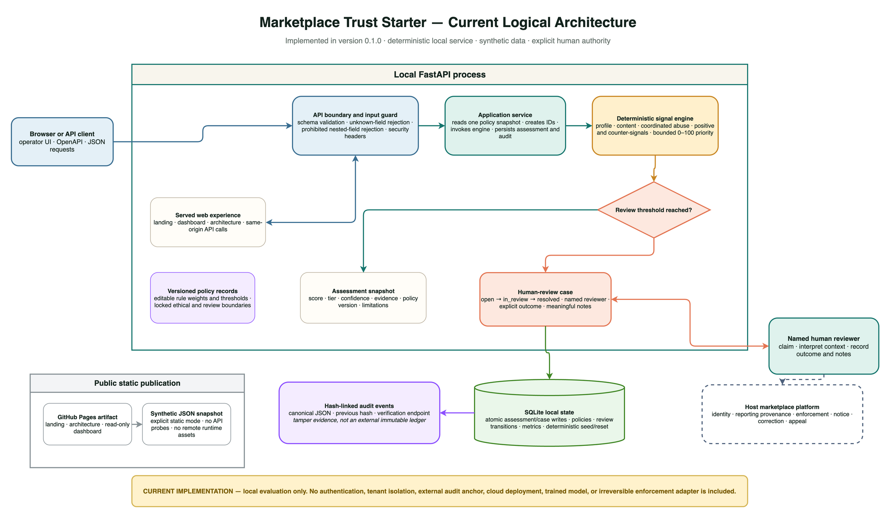
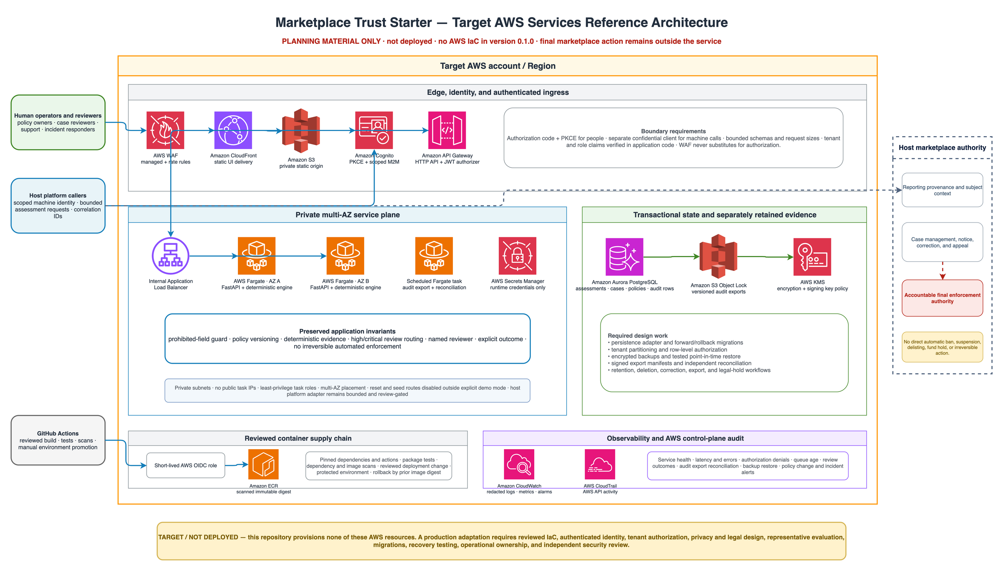

# Marketplace Trust Starter

Marketplace Trust Starter is a neutral, open-source reference product for
marketplaces and communities that need an understandable trust-and-safety
baseline. It combines deterministic profile, content, and coordinated-abuse
signals with policy controls, durable evidence, a real human-review workflow,
and a hash-linked audit trail.

It runs locally with seeded fictional data. No API keys, model downloads, or
external service calls are required at runtime.

[Live project site](https://hk-775.github.io/marketplace-trust-starter/) ·
[Quick start](QUICKSTART.md) ·
[Architecture](docs/ARCHITECTURE.md) ·
[Responsible use](docs/ETHICS.md) ·
[Production readiness](docs/PRODUCTION_READINESS.md)

## Start the complete demo

Prerequisites:

- Python 3.11–3.13
- [uv](https://docs.astral.sh/uv/) 0.10.7 or newer

```bash
./scripts/demo.sh
```

Open:

- Product page: `http://127.0.0.1:8101`
- Operator dashboard: `http://127.0.0.1:8101/dashboard`
- Interactive architecture: `http://127.0.0.1:8101/architecture`
- OpenAPI documentation: `http://127.0.0.1:8101/api/docs`

The script synchronizes the committed lockfile and starts the console entry
point through `uv run --locked`. Dependency installation may contact the
configured package index. After installation, the product itself makes no
external network calls.

See [QUICKSTART.md](QUICKSTART.md) for Docker, curl, and demo walkthrough
options.

## What is included

- Deterministic fake-profile risk using observable account behavior, content
  reuse, report context, and transaction outcomes.
- Precision-first scam, spam, credential-harvesting, and direct-threat rules.
- Coordinated-abuse signals that corroborate similarity, velocity, target
  concentration, reports, and shared infrastructure.
- Explainable 0–100 review-priority scores, risk tiers, confidence, positive
  signals, counter-signals, policy version, and limitations.
- A human-review queue with enforced `open → in_review → resolved` transitions,
  named reviewers, explicit outcomes, and required resolution notes.
- Editable rule weights and thresholds with locked governance and ethical
  boundaries.
- SQLite state, deterministic seed reset, operational metrics, signal insights,
  and a verified SHA-256 audit chain.
- A responsive landing page, working operator dashboard, interactive animated
  architecture page, and an exact static mirror under `site/`.

## Responsible-use boundary

This project evaluates documented behavior and content patterns. It explicitly
does not:

- infer protected attributes;
- accept or analyze faces, biometrics, skin tone, attractiveness, beauty, or
  personal appearance;
- claim that a risk score proves intent, abuse, fraud, or identity;
- execute an irreversible automated enforcement action;
- silently learn from reviewer outcomes or mutate policy.

Prohibited fields are rejected before scoring, and the corresponding policy
boundary is not editable. High and critical results create review work; a
person must interpret context and record the outcome.

Read [docs/ETHICS.md](docs/ETHICS.md) before adapting the starter.

## Architecture

### Current local architecture



```text
Browser / API client
        |
        v
FastAPI validation and ethical input guard
        |
        v
Application service ----> versioned policy snapshot
        |
        v
Deterministic signal engine
        |
        +---- low / guarded ----> assessment + audit
        |
        +---- high / critical --> assessment + review case + audit
                                      |
                                      v
                               named human reviewer
                                      |
                                      v
                               outcome + audit + metrics
```

The service is intentionally compact:

- `engine.py` is pure scoring logic with no I/O.
- `service.py` routes assessments and creates review work.
- `store.py` owns SQLite transactions, policy state, review transitions,
  metrics, reset, and audit verification.
- `app.py` exposes the API and serves the dependency-free web experience.

See [docs/ARCHITECTURE.md](docs/ARCHITECTURE.md) for transaction and extension
details.

### Target AWS services reference



This is a **target reference, not a deployed topology**. It maps documented
production gaps to one possible AWS shape using Amazon CloudFront, AWS WAF,
Amazon S3, Amazon Cognito, Amazon API Gateway, Elastic Load Balancing, Amazon
ECS on AWS Fargate, Amazon Aurora PostgreSQL, Amazon S3 Object Lock, AWS KMS,
AWS Secrets Manager, Amazon CloudWatch, AWS CloudTrail, Amazon ECR, and
short-lived GitHub Actions OIDC credentials.

Version 0.1.0 contains no AWS infrastructure as code and creates no cloud
resources. The host platform retains final enforcement, notice, correction,
and appeal authority. Download the
[editable draw.io source](site/assets/aws-services-reference.drawio) or read
the exact boundary mapping in
[docs/ARCHITECTURE.md](docs/ARCHITECTURE.md#target-aws-services-reference-architecture).

## API summary

| Method | Path | Purpose |
|---|---|---|
| `GET` | `/api/v1/health` | Health, seed counts, and ethical boundaries |
| `POST` | `/api/v1/assess/profile` | Assess observable profile risk |
| `POST` | `/api/v1/assess/content` | Assess scam, spam, or malicious content |
| `POST` | `/api/v1/assess/coordinated-abuse` | Assess aggregate coordination signals |
| `GET` | `/api/v1/assessments` | List durable assessment snapshots |
| `GET` | `/api/v1/cases` | List review cases |
| `PATCH` | `/api/v1/cases/{case_id}` | Claim or resolve a case |
| `GET` | `/api/v1/metrics` | Operational KPIs and distributions |
| `GET` | `/api/v1/insights` | Rule hits and responsible-use safeguards |
| `GET/PATCH` | `/api/v1/policies[/{policy_id}]` | Read or update policy rules |
| `GET` | `/api/v1/audit` | Read events and verify the audit chain |
| `GET/POST` | `/api/v1/demo/scenarios[/{scenario_id}]` | List or run guided demos |
| `POST` | `/api/v1/demo/reset` | Restore canonical fictional seed state |

Complete contracts and examples are in [docs/API.md](docs/API.md) and the
served OpenAPI UI.

## Seeded demo

First boot creates:

- 10 assessments spanning low, guarded, high, and critical tiers;
- 6 review cases, including active work and documented outcomes;
- 28 policy records, including locked ethical and review boundaries;
- a verified audit chain;
- fictional subjects such as `cedar-otter-104` and
  `cluster-northstar`.

Use the dashboard reset button or:

```bash
curl -X POST http://127.0.0.1:8101/api/v1/demo/reset \
  -H 'Content-Type: application/json' \
  -d '{"actor":"demo-operator","confirmation":"RESET DEMO"}'
```

See [docs/DEMO.md](docs/DEMO.md) for a meeting-ready walkthrough.

## Test and validate

```bash
./scripts/test.sh
./scripts/validate.sh
```

The suite covers scoring, precision-sensitive benign examples, protected-field
rejection, API state isolation, policy versioning, review transitions, audit
integrity, and seed reset. Validation also checks the repository and reachable
history, verifies the static mirror, builds temporary package archives,
exercises the exact Pages base in Chrome without external requests, and runs a
live HTTP smoke test on port `8101`.

## Docker

```bash
docker compose up --build
```

Open `http://127.0.0.1:8101`. State is stored in the named
`marketplace_trust_data` volume. See
[docs/DEPLOYMENT.md](docs/DEPLOYMENT.md) for configuration and production gaps.

## Static site

`site/` is the explicit static-mode build of the landing, dashboard, and
architecture pages. The dashboard loads a deterministic read-only snapshot
and never probes an API route. Live mutations remain available only when the
local service is running.

Rebuild or verify the mirror:

```bash
uv run --locked python scripts/build_site.py
uv run --locked python scripts/build_site.py --check
```

## Project status

This is a starter and demonstration product, not a production moderation
service. A real deployment still needs authentication, authorization, privacy
review, jurisdiction-specific policy, calibrated evaluation, monitoring,
appeals, data-retention controls, abuse-resistant reporting, and integrations
with the host platform.

The evidence and remaining blockers are tracked in
[docs/PRODUCTION_READINESS.md](docs/PRODUCTION_READINESS.md). Public release
contents are listed in
[docs/PUBLICATION_ARTIFACTS.md](docs/PUBLICATION_ARTIFACTS.md).

## License

MIT No Attribution (MIT-0). See [LICENSE](LICENSE) and [NOTICE](NOTICE).
